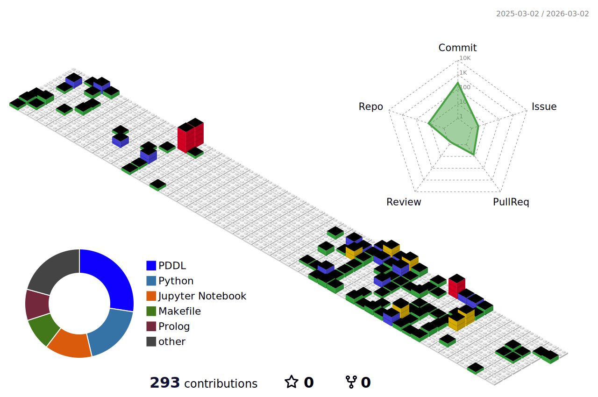

# Hi there! I'm Albert Aulet 👋

## About Me
I'm a passionate computer engineering student at FIB - UPC, heavily interested in algorithms and AI.

- 🌱 Currently learning Qiskit and PyTorch 
- 👨🏼‍💻 Looking to collaborate on open source projects  
- 📫 Reach me at: albert.aulet013@gmail.com  

---

## 🚀 Languages and Tools

### Languages

### Frameworks & Libraries

### Version Control

### Databases

### Editors & IDEs

### Other Tools

---

## 📌 Featured Projects

### [Sistema Bicing](https://github.com/albeertauleet/sistema-bicing)
A bicing system implemented as a binary tree, where each node represents a station. Various operations allow efficient organization of bikes.

### [Ejercicios EDA](https://github.com/albeertauleet/ejercicios-eda)
Exercises to practice for the EDA exams in the Computer Engineering degree at UPC.

---
## 🌐 Find Me At

 

